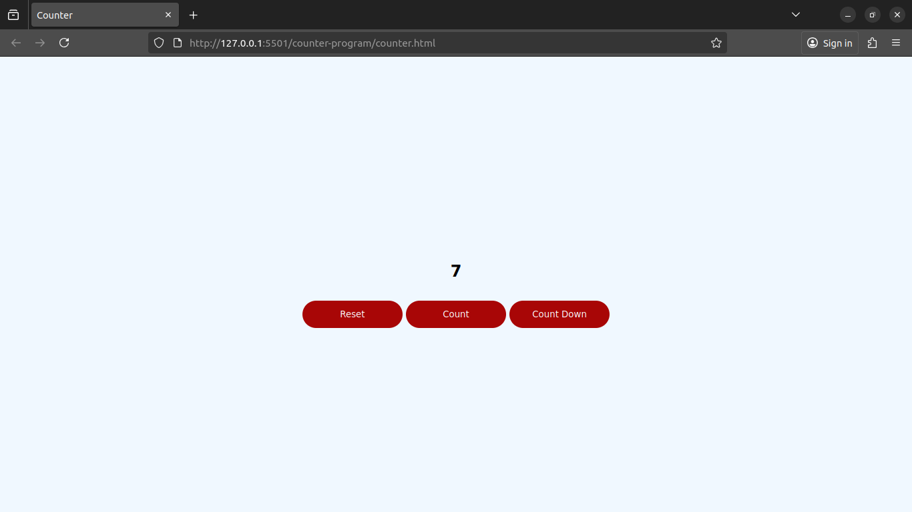

# 🔢 Counter Program

A simple **JavaScript counter app** that lets you increase, decrease, or reset a number on the screen.  
Built using **HTML**, **CSS**, and **JavaScript** — no frameworks, no libraries.

---

## 🚀 Demo



---

## 🧩 Features
- ➕ **Count Up:** Increments the displayed number.
- ➖ **Count Down:** Decrements the number.
- 🔁 **Reset:** Sets the number back to zero.
- ⚡ Instant updates without refreshing the page.

---

## 🛠️ Technologies Used
- **HTML5** for structure  
- **CSS3** for styling  
- **JavaScript (DOM)** for interactivity

---

## 🧠 How It Works
The program listens for button clicks using `document.getElementById()` and updates the number in the DOM with:
```js
document.getElementById('display').textContent = number;
